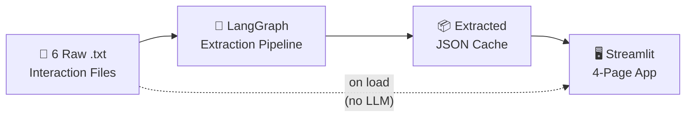
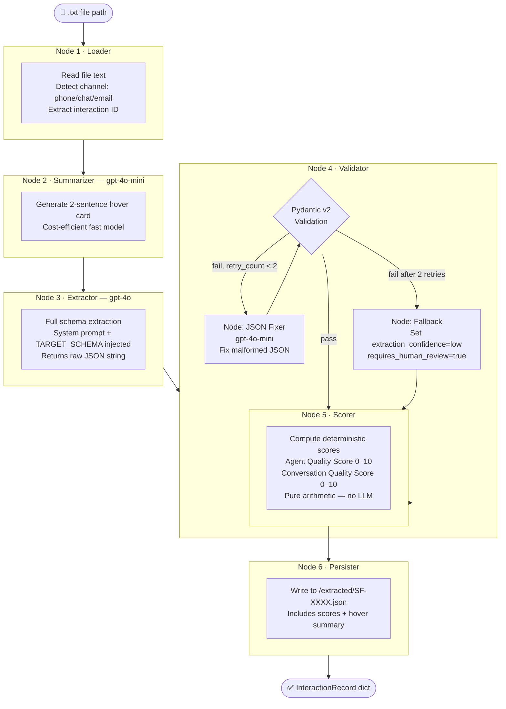
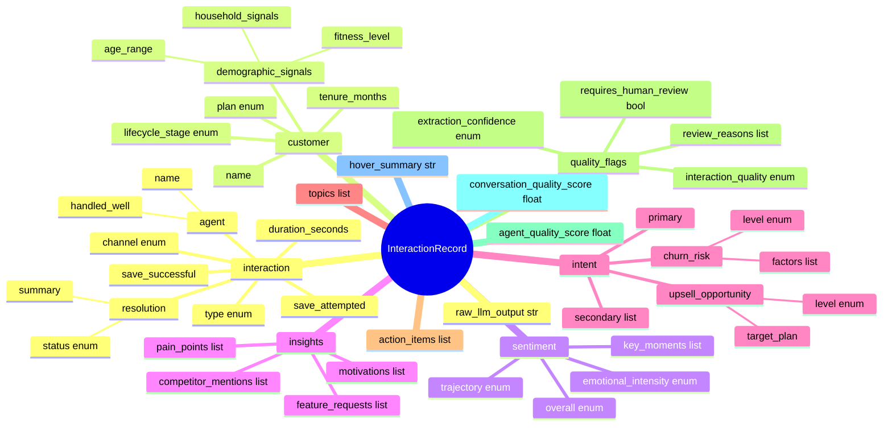
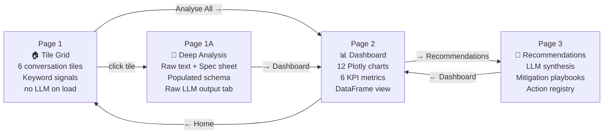

# StreamFit — Implementation Log

> What was built, how it works, and every key decision made.
> This document covers the full demo implementation from blank repo to working Streamlit app.

---

## 1. What We Built

A 4-page Streamlit intelligence platform that:
1. Ingests raw customer interaction `.txt` transcripts
2. Runs a **LangGraph 6-node AI extraction pipeline** to populate a structured Pydantic schema
3. Renders an analytics dashboard across **12 Plotly charts**
4. Produces **LLM-synthesised strategic recommendations** grounded in real aggregated data



---

## 2. Tech Stack

| Layer | Technology | Why |
|-------|-----------|-----|
| UI | Streamlit 1.55 | Rapid prototyping, native charts support |
| Pipeline orchestration | LangGraph 0.2 | Stateful graph with conditional retry edges |
| LLM — extraction | OpenAI GPT-4o | Highest accuracy for structured JSON output |
| LLM — summaries/fixes | OpenAI GPT-4o-mini | Cost-efficient for fast, cheap sub-tasks |
| LLM — synthesis | OpenAI GPT-4o | Strategic reasoning across aggregated data |
| Schema validation | Pydantic v2 | Strict type enforcement, auto-validation |
| Analytics | Pandas + Plotly | DataFrame aggregations + interactive charts |
| Tracing | LangSmith | Automatic LangGraph trace capture |
| Config | python-dotenv | `.env` file for API keys |

---

## 3. Repository Structure

```
neilson/
├── streamlit_app.py            ← Entry point: streamlit run streamlit_app.py
│
├── pipeline/                   ← AI extraction engine
│   ├── models.py               ← Pydantic schema (mirrors TARGET_SCHEMA.json)
│   ├── graph.py                ← LangGraph 6-node pipeline
│   ├── prompts.py              ← All LLM system + user prompts
│   └── loader.py               ← File reader, channel detector, keyword scanner
│
├── analysis/                   ← Data layer
│   ├── dataframe.py            ← JSON → flat Pandas DataFrame
│   └── charts.py               ← 12 Plotly chart functions
│
├── app/                        ← Streamlit pages
│   ├── page1_tiles.py          ← Tile grid (no LLM on load)
│   ├── page1a_detail.py        ← Deep analysis spec sheet
│   ├── page2_dashboard.py      ← Consolidated dashboard
│   └── page3_recommender.py    ← LLM strategic recommendations
│
├── interactions/               ← 6 raw .txt transcript files
├── extracted/                  ← JSON cache (populated after "Analyse All")
├── ai_workflow/                ← AI workflow evidence folder
│
├── TARGET_SCHEMA.json          ← Ground-truth output schema
├── SOLUTION_ARCHITECTURE.md   ← Full production architecture
└── requirements.txt
```

---

## 4. LangGraph Extraction Pipeline

The core engine. Runs once per file and caches the result. **Re-running skips cached files.**



### LangGraph State Object

```python
class PipelineState(TypedDict):
    file_path: str
    interaction_id: str
    raw_text: str
    channel: str           # phone | live_chat | email
    summary: str           # 2-sentence hover card
    raw_llm_output: str    # raw string before Pydantic parsing
    extracted_dict: dict   # parsed JSON
    validated_record: dict # validated Pydantic model dump
    scores: dict           # agent_quality_score, conversation_quality_score
    retry_count: int       # max 2 retries before fallback
    errors: list[str]
```

---

### 4.1 Conditional Save Detection

A two-layer safety net that catches fragile retentions — cases where the LLM correctly marks `save_successful=True` but may miss the conditional nature of the customer's agreement to stay.

**Layer 1 — LLM extraction (prompts.py):**
The `EXTRACTION_SYSTEM` prompt instructs GPT-4o to detect conditional language and populate `ChurnRisk.save_condition` with a third-person description of the condition. Example output:
> `"Customer will cancel if advanced strength training content is not live by April 15."`

**Layer 2 — Deterministic regex fallback (graph.py):**
`detect_conditional_save()` runs immediately after Pydantic validation in Node 4. It scans the raw transcript for conditional patterns regardless of what the LLM extracted. If a match is found and `save_successful=True`, it forcibly sets `requires_human_review=True` and appends a specific review reason.

This ensures that even if the LLM missed or misclassified the condition, the record is still flagged.

**Pattern list:**

| Pattern | Example trigger |
|---------|----------------|
| `if (i\|we) don't see` | "If I don't see new content by April..." |
| `give it \w+ months` | "I'll give it three months" |
| `fair warning` | "Fair warning, if nothing changes..." |
| `last chance` | "This is the last chance" |
| `gone for good` | "I'm gone for good" |
| `only if` | "Only if you fix the app" |
| `unless` | "Unless I see improvements..." |
| `by <month name>` | "by April", "by March 31st" |

**UI surface:** `page1a_detail.py` renders a yellow `st.warning()` box in the Churn & Upsell section whenever `save_condition` is populated — making fragile retention visible without requiring a JSON inspection.

---

## 5. Scoring Logic (Node 5 — Deterministic)

No LLM involved. Pure arithmetic on extracted fields. Both scores max at 10.0.

### Agent Quality Score

Measures how well the agent handled the interaction. Weights ordered by business importance.

```
# Weight rationale:
# Resolution (3.5)            — the single most important signal. Did the agent actually solve the problem?
# Interaction Quality (2.5)   — clean, complete transcripts reflect agent professionalism.
# Empathy (2.0)               — important for CX but a secondary quality signal.
# Action Follow-through (2.0) — rewards agents who close items, but outcome > process.
# Total ceiling: 10.0. partially_resolved can score max ~8.3, not 9.0.

agent_quality_score = min(resolution + interaction_quality + empathy + action_follow_through, 10.0)
```

| Sub-score | Field | Values | Max | Rationale |
|-----------|-------|--------|-----|-----------|
| **Resolution** | `interaction.resolution.status` | resolved=3.5, partially_resolved=1.8, escalated=1.2, cancelled=0.5, unresolved=0.0 | **3.5** | Primary outcome — did the agent solve the problem? |
| **Interaction Quality** | `quality_flags.interaction_quality` | clean=2.5, minor_issues=1.5, significant_gaps=0.5 | **2.5** | Transcript quality reflects agent discipline |
| **Empathy** | `interaction.agent.handled_well` | True=2.0, False=0.8 | **2.0** | Secondary to outcome; partial credit even when low |
| **Action Follow-through** | `action_items[].status` | completed/total × 2.0 | **2.0** | Rewards closure, but outcome > process |

### Conversation Quality Score

Measures how rich and signal-dense the conversation was — independent of the agent.

```
conversation_quality_score = extraction_confidence + schema_completeness + sentiment_trajectory
```

| Sub-score | Field | Values |
|-----------|-------|--------|
| Extraction Confidence | `quality_flags.extraction_confidence` | high=4.0, medium=2.5, low=1.0 |
| Schema Completeness | 4 key sections present | (filled / 4) × 3.0 |
| Sentiment Trajectory | `sentiment.trajectory` | improving=3.0, stable=2.0, declining=1.0 |

> **Key insight:** A great agent can have a low conversation score (sparse transcript). A terrible agent can have a high conversation score (angry, detailed complaint = rich signal). They measure different things.

---

## 6. Pydantic Schema (pipeline/models.py)

Mirrors `TARGET_SCHEMA.json` exactly. ~30 enums, 10+ nested models.



---

## 7. App Navigation & Pages



### Page 1 — Tile Grid (no LLM on load)

- 3-column grid of 6 interaction tiles
- Each tile shows: channel icon, interaction ID, agent name, date, duration, analysis status
- **Popover (no LLM):** instant keyword signals via `peek_signals()` heuristic scan
- Signal types: `🚨 Churn Risk` `⚠️ Competitor` `💳 Billing` `📚 Content Gap` `🔧 Tech Issue` `😤 High Emotion` `🎯 Upsell Signal` `💡 Save Offer` `✅ Positive`
- If already analysed: shows churn level, agent score, sentiment from cache
- **⚡ Analyse All** is the ONLY trigger for LLM calls

### Page 1A — Deep Analysis

- Two-column layout: raw transcript (40%) | spec sheet (60%)
- **3 tabs:** Spec Sheet · Populated Schema JSON · Raw LLM Output
- Spec sheet sections: Interaction Snapshot · Core Problem · Customer Profile · Sentiment Analysis · Churn & Upsell Signals · Agent Scorecard · Action Items · Quality Flags

### Page 2 — Dashboard

**12 charts across 4 sections:**

| Section | Charts |
|---------|--------|
| 1. Customer Health | Churn Risk Bar · Lifecycle Donut · Sentiment by Channel |
| 2. Pain Points | Top Pain Categories · Pain Severity Heatmap · Feature Request Chart |
| 3. Agent Performance | Agent Quality Bar · Resolution Donut · Save Attempts Funnel |
| 4. Opportunities | Upsell Scatter · Competitor Tracker · High-Value At-Risk Table |

### Page 3 — LLM Recommendations

Calls GPT-4o once with aggregated DataFrame stats. Returns structured JSON answering 3 business questions.

**Output per churn driver:**
- Root cause analysis
- 3-step time-boxed mitigation playbook (0–7d / 8–30d / 30–90d)
- KPI to track

**Output per product improvement:**
- Root cause
- Week-by-week implementation roadmap
- Success metric

**Output per action item:**
- Exact `how_to_execute` instructions (2–3 sentences)
- Deadline in days + evidence

---

## 8. Prompts (pipeline/prompts.py)

| Prompt | Model | Purpose | Max Tokens |
|--------|-------|---------|------------|
| `SUMMARY_SYSTEM` | gpt-4o-mini | 2-sentence hover card summary | 200 |
| `EXTRACTION_SYSTEM` | gpt-4o | Full schema extraction, TARGET_SCHEMA injected | 4096 |
| `JSON_FIX_SYSTEM` | gpt-4o-mini | Repair malformed JSON on retry | 4096 |
| `SYNTHESIS_SYSTEM` | gpt-4o | Strategic Q&A with grounded stats | 4096 |

**Model routing rationale:**
- GPT-4o-mini for short, structured, low-stakes tasks (summary, JSON repair)
- GPT-4o for high-stakes extraction and strategic synthesis

---

## 9. Keyword Signal Scanner (pipeline/loader.py)

`peek_signals(raw_text)` runs with **zero LLM calls**. Pure regex/string matching against 9 domain-specific signal categories. Returns up to 5 `(icon, label)` tuples for display in tile popovers.

```python
# Example output for SF-2026-0001 (cancellation call with competitor mention):
[
    ("🚨", "Churn Risk"),
    ("⚠️", "Competitor Mention"),
    ("💳", "Billing"),
    ("📚", "Content Gap"),
    ("🎯", "Upsell Signal"),
]
```

---

## 10. Key Implementation Decisions

| Decision | What we chose | Why |
|----------|--------------|-----|
| LLM provider | OpenAI (GPT-4o / GPT-4o-mini) | Only available API key; LangSmith tracing still works |
| Tracing | LangSmith via `LANGCHAIN_TRACING_V2=true` | Zero code changes needed — automatic with LangGraph |
| Data scale | 6 interaction files | Sufficient signal diversity for demo; avoids high API cost |
| Page load strategy | No LLM on load | Tiles render instantly; LLM only fires on explicit "Analyse All" |
| Hover preview | Keyword signals (heuristic) | Instant, free, visually informative without waiting for API |
| Scoring | Deterministic arithmetic | No LLM variance in scores; reproducible, auditable |
| Retry strategy | 2 retries → fallback | Balances cost vs. reliability; fallback flags for human review |
| Disk cache | `/extracted/*.json` | Pipeline skips already-processed files; mimics production batch pattern |
| Grounding | Real `get_aggregated_stats(df)` passed to synthesis | All LLM claims backed by actual data numbers |

---

## 11. Environment Setup

```bash
# 1. Install dependencies
pip install openai langgraph langsmith pydantic streamlit pandas plotly python-dotenv

# 2. Create .env (copy from .env.example, fill in your keys)
cp .env.example .env

# 3. Run
streamlit run streamlit_app.py
```

**.env variables:**
```
OPENAI_API_KEY=sk-...
LANGCHAIN_TRACING_V2=true
LANGCHAIN_API_KEY=lsv2_pt_...
LANGCHAIN_PROJECT=streamfit-audit
```

> **Note:** `.env` must never be committed to git. Add to `.gitignore`.

---

## 12. Fresh Analysis Run

To reset and re-run the full pipeline from scratch:

```bash
# Delete all cached extractions
rm extracted/SF-*.json

# Restart app
streamlit run streamlit_app.py
# → Click "⚡ Analyse All Files" on Page 1
```

---

---

## 13. Extraction Accuracy Evaluation

To ground the pipeline in measurable performance, an evaluation module was built that compares LLM extraction output against a manually annotated reference JSON.

**Evaluated file:** SF-2026-0001 (cancellation call, conditional save, premium member, 25 months tenure)

**Module:** `evaluation/evaluator.py` — `FieldAccuracyEvaluator` class

**Method:**
- Developer manually annotated `evaluation/reference/SF-2026-0001_reference.json` by reading the raw transcript
- `FieldAccuracyEvaluator` compares 18 fields across 5 sections using type-appropriate scoring rules
- Results visible in Page 1A → **📊 Extraction Eval** tab (appears only when a reference file exists for the interaction)

### Scoring Rules

| Field Type | Rule | Partial Credit |
|-----------|------|---------------|
| Enums, booleans, strings | Exact match (case-insensitive) | None — 1.0 or 0.0 |
| Numerics (e.g. tenure_months) | ±10% tolerance → 1.0 | ±25% → 0.5, else 0.0 |
| Arrays | Jaccard similarity on normalised elements | Continuous 0–1 |
| Free-text (e.g. save_condition) | Presence check — both null or both non-null | None — 1.0 or 0.0 |
| Both null | Correct abstention → 1.0 | — |

### Fields Evaluated (18 total across 5 sections)

| Section | Fields |
|---------|--------|
| interaction | type, channel, resolution.status, agent.handled_well |
| customer | current_plan, lifecycle_stage, tenure_months, fitness_level |
| sentiment | overall, trajectory, emotional_intensity |
| intent | churn_risk.level, save_attempted, save_successful, save_condition (presence), upsell.level |
| quality_flags | extraction_confidence, requires_human_review |

### Why This Matters

Schema extraction is a measurable NLP task. Without evaluation, "the pipeline works" is anecdotal. With a reference set, accuracy becomes a tracked metric — and prompt changes can be A/B tested against it.

**At production scale:** 1–2% of interactions would be human-reviewed by the QA team and added as reference files. This creates a continuous evaluation loop: `prompt change → re-run evaluator → compare accuracy delta → accept or revert`.

### Scalability Design

The evaluator is reference-file-driven. The tab appears automatically whenever a file matching the pattern `evaluation/reference/{interaction_id}_reference.json` exists — **no code changes needed** to add more reference interactions. Drop in the file and the tab appears.

```
evaluation/
├── __init__.py
├── evaluator.py                        ← FieldAccuracyEvaluator class
└── reference/
    └── SF-2026-0001_reference.json     ← manually annotated ground truth
```

*Built as part of the Neilson Data & AI Builder technical assessment — StreamFit scenario.*
