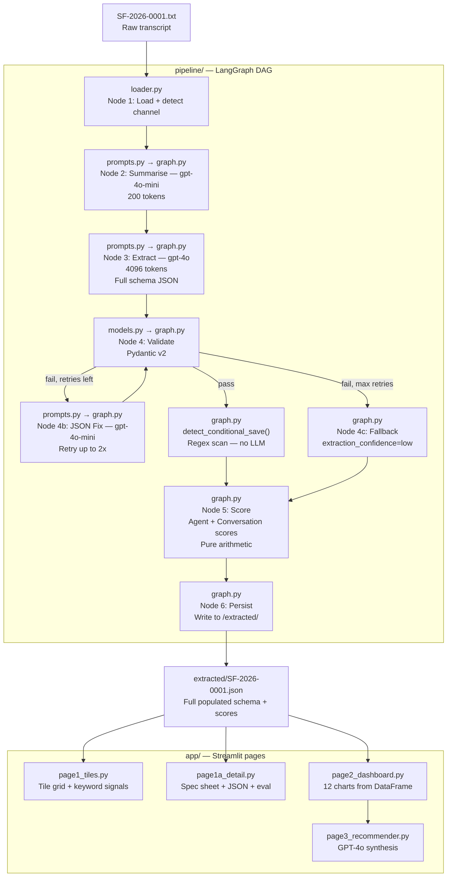
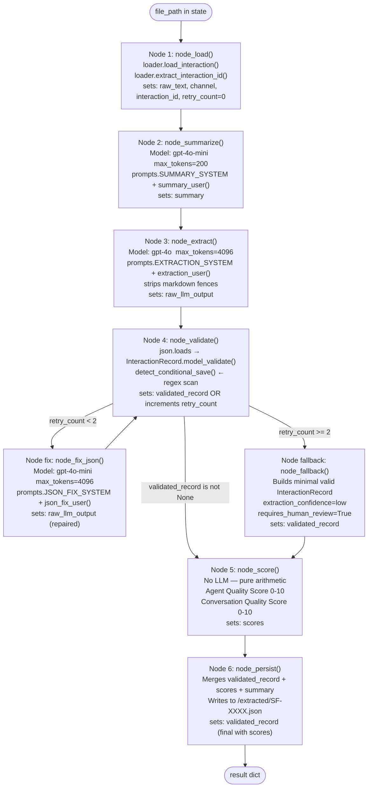

# StreamFit — Code Reference Guide

> Where everything lives, what it does, and how it all connects.
> Read this to understand the codebase without reading every file.

---

## Directory Map

```
neilson/
│
├── streamlit_app.py          ← App entry point + router
│
├── pipeline/                 ← AI extraction engine (the core)
│   ├── models.py             ← Every data type and the Pydantic schema
│   ├── prompts.py            ← All text sent to the LLM
│   ├── graph.py              ← LangGraph DAG — 6 nodes + scoring + conditional save
│   └── loader.py             ← File I/O, channel detection, keyword signals
│
├── analysis/
│   ├── dataframe.py          ← JSON → flat Pandas DataFrame + aggregated stats
│   └── charts.py             ← 12 Plotly chart functions
│
├── app/
│   ├── page1_tiles.py        ← Page 1: tile grid
│   ├── page1a_detail.py      ← Page 1A: deep analysis spec sheet
│   ├── page2_dashboard.py    ← Page 2: analytics dashboard
│   └── page3_recommender.py  ← Page 3: LLM strategic recommendations
│
├── evaluation/
│   ├── evaluator.py          ← FieldAccuracyEvaluator — compares output vs reference
│   └── reference/
│       └── SF-2026-0001_reference.json  ← Manually annotated ground truth
│
├── interactions/             ← 6 raw .txt transcript files (input)
├── extracted/                ← Populated JSON files (pipeline output cache)
│
├── TARGET_SCHEMA.json        ← The schema the LLM is asked to populate
├── SOLUTION_ARCHITECTURE.md  ← Production Azure + Databricks architecture
├── IMPLEMENTATION_LOG.md     ← Build log with decisions and scoring docs
└── REFERENCE.md              ← This file
```

---

## How a Single Interaction Flows Through the System



---

## File-by-File Reference

---

### `streamlit_app.py` — Entry Point

**What it does:**
- Sets Streamlit page config (wide layout, icon)
- Injects global CSS (tile card styles, churn risk border colours, score pills)
- Initialises `st.session_state` with default keys
- Routes to the correct page based on `st.session_state.page`

**Session state keys:**

| Key | Type | Purpose |
|-----|------|---------|
| `page` | str | Current page: `home` / `detail` / `dashboard` / `recommender` |
| `selected_id` | str | Interaction ID open in Page 1A |
| `summaries` | dict | Hover summary cache: `{id → summary_str}` |
| `extracted` | dict | In-memory extraction cache: `{id → record_dict}` |
| `dataframe` | DataFrame | Built once after Analyse All, reused across pages |
| `records_cache` | list | All extracted records as list of dicts |
| `recommendations` | dict | Page 3 LLM output (cached until Regenerate) |

**Navigation flow:**
```
st.session_state.page = "home"       → render_page1()
st.session_state.page = "detail"     → render_page1a()
st.session_state.page = "dashboard"  → render_page2()
st.session_state.page = "recommender"→ render_page3()
```

---

### `pipeline/models.py` — Every Data Type

**What it does:**
Defines every Pydantic model and enum that the pipeline uses. Nothing else. No logic, no I/O.

**Structure:**

```
30+ Enums  →  Sub-models  →  Root model (InteractionRecord)  →  PipelineState (TypedDict)
```

**Key enums (examples):**

| Enum | Values |
|------|--------|
| `InteractionType` | cancellation, support_request, complaint, sales_inquiry, upgrade_inquiry, win_back, general_inquiry |
| `ResolutionStatus` | resolved, partially_resolved, unresolved, escalated, cancelled |
| `ChurnRiskLevel` | none, low, medium, high, immediate |
| `LifecycleStage` | new, onboarding, active, at_risk, churning, churned, win_back |
| `SentimentOverall` | very_negative, negative, mixed, neutral, positive, very_positive |
| `SentimentTrajectory` | improving, stable, declining |
| `CurrentPlan` | free_trial, basic, premium, family, enterprise, unknown |
| `ExtractionConfidence` | high, medium, low |

**Sub-model hierarchy:**

```
InteractionRecord
├── interaction: InteractionMeta
│   ├── type: InteractionType
│   ├── channel: Channel
│   ├── duration_seconds: int
│   ├── agent: Agent
│   │   ├── name: str
│   │   ├── handled_well: bool
│   │   └── notable_actions: str
│   └── resolution: Resolution
│       ├── status: ResolutionStatus
│       └── summary: str
├── customer: Customer
│   ├── name: str
│   ├── tenure_months: int
│   ├── current_plan: CurrentPlan
│   ├── lifecycle_stage: LifecycleStage
│   └── demographic_signals: DemographicSignals
│       ├── age_range: AgeRange
│       ├── fitness_level: FitnessLevel
│       └── household: str
├── sentiment: Sentiment
│   ├── overall: SentimentOverall
│   ├── trajectory: SentimentTrajectory
│   ├── emotional_intensity: EmotionalIntensity
│   └── key_moments: list[KeyMoment]
├── insights: Insights
│   ├── pain_points: list[PainPoint]
│   ├── motivations: list[Motivation]
│   ├── competitor_mentions: list[CompetitorMention]
│   └── feature_requests: list[FeatureRequest]
├── intent: Intent
│   ├── primary: str
│   ├── churn_risk: ChurnRisk
│   │   ├── level: ChurnRiskLevel
│   │   ├── factors: list[str]
│   │   ├── save_attempted: bool
│   │   ├── save_successful: bool
│   │   └── save_condition: str  ← EXTENSION: conditional save text
│   └── upsell_opportunity: UpsellOpportunity
│       ├── level: UpsellLevel
│       ├── target_plan: str
│       └── signals: list[str]
├── topics: list[Topic]
├── action_items: list[ActionItem]
├── quality_flags: QualityFlags
│   ├── interaction_quality: InteractionQuality
│   ├── extraction_confidence: ExtractionConfidence
│   ├── requires_human_review: bool
│   └── review_reasons: list[str]
│
│   ── Schema Extensions (not in TARGET_SCHEMA.json) ──
├── agent_quality_score: float        ← Node 5, deterministic
├── conversation_quality_score: float ← Node 5, deterministic
├── hover_summary: str                ← Node 2, gpt-4o-mini
└── raw_llm_output: str               ← Node 3, stored for auditability
```

**`PipelineState` (TypedDict) — the object passed between nodes:**

```python
{
    "file_path": str,
    "interaction_id": str,
    "raw_text": str,
    "channel": str,             # phone | live_chat | email
    "summary": str,             # 2-sentence summary from Node 2
    "raw_llm_output": str,      # raw JSON string from Node 3
    "extracted_dict": dict,     # parsed JSON (may be {})
    "validated_record": dict,   # Pydantic-validated model dump (or None)
    "scores": dict,             # {"agent_quality_score": x, "conversation_quality_score": y}
    "retry_count": int,         # increments on validation failure
    "errors": list[str],        # accumulates error messages
}
```

---

### `pipeline/loader.py` — File I/O + Signals

**What it does:** Reads `.txt` files, detects channel type, extracts metadata without any LLM call.

**Functions:**

| Function | Does |
|----------|------|
| `load_interaction(file_path)` | Reads raw text, returns `(text, channel)` |
| `detect_channel(raw_text)` | Heuristic regex: email signals → phone timestamps → chat markers → default phone |
| `list_all_interactions()` | Returns first 6 `SF-*.txt` paths sorted — `ACTIVE_INTERACTIONS = 6` constant |
| `extract_interaction_id(path)` | Returns filename stem e.g. `SF-2026-0001` |
| `peek_agent_name(raw_text)` | Regex scan of first 30 lines — returns agent name without LLM |
| `peek_signals(raw_text)` | Scans for 9 domain keyword categories, returns `list[(icon, label)]` |

**`peek_signals()` — keyword categories:**

| Icon | Label | Triggers on |
|------|-------|-------------|
| 🚨 | Churn Risk | cancel, cancellation, leaving, quit |
| ⚠️ | Competitor Mention | fitflow, competitor, switching to |
| 💳 | Billing | billing, charge, refund, overcharged |
| 📚 | Content Gap | stale, same workout, no new content |
| 🔧 | Tech Issue | app crash, error, bug, samsung, playback |
| 😤 | High Emotion | frustrated, angry, unacceptable, furious |
| 🎯 | Upsell Signal | upgrade, annual plan, family plan |
| 💡 | Save Offer | discount, half price, loyalty offer |
| ✅ | Positive | thank you, very helpful, love the |

> Zero LLM calls. Used only on Page 1 tile popovers.

---

### `pipeline/prompts.py` — All LLM Text

**What it does:** Defines every system prompt and user message factory function. No logic — pure text. Loaded once at import time.

**Prompt 1 — `SUMMARY_SYSTEM` + `summary_user(raw_text)`**
- **Model:** `gpt-4o-mini`
- **Called in:** Node 2 (Summariser)
- **Task:** Generate a 2-sentence hover card summary. Sentence 1: what the customer needed. Sentence 2: how it was resolved.
- **Max tokens:** 200

**Prompt 2 — `EXTRACTION_SYSTEM` + `extraction_user(id, channel, raw_text)`**
- **Model:** `gpt-4o`
- **Called in:** Node 3 (Extractor)
- **Task:** Full schema extraction. `TARGET_SCHEMA.json` is injected as a string into the system prompt at module load time. Returns raw JSON only.
- **Max tokens:** 4096
- **Special instruction added:** `CONDITIONAL SAVE DETECTION` — tells GPT-4o to populate `save_condition` when conditional language is present in a save.

**Prompt 3 — `JSON_FIX_SYSTEM` + `json_fix_user(invalid_json, error)`**
- **Model:** `gpt-4o-mini`
- **Called in:** Node 4b (JSON Fixer, retry path)
- **Task:** Repair malformed JSON. Passed the broken string + the Pydantic/JSON error message.
- **Max tokens:** 4096

**Prompt 4 — `SYNTHESIS_SYSTEM` + `synthesis_user(stats_dict)`**
- **Model:** `gpt-4o`
- **Called in:** Page 3 (`_run_synthesis()`)
- **Task:** Answer 3 business questions with grounded data. Passed the real `get_aggregated_stats(df)` dict so all claims reference actual numbers.
- **Max tokens:** 4096
- **Returns structured JSON:** executive_summary, churn_drivers (with mitigation_steps), upsell_segments (with outreach_playbook), product_improvements (with implementation_roadmap), action_items (with how_to_execute)

---

### `pipeline/graph.py` — The LangGraph DAG

**What it does:** Builds and runs the 6-node extraction pipeline. This is the engine.

#### The DAG



#### Key Functions

| Function | Purpose |
|----------|---------|
| `get_client()` | Returns singleton `OpenAI()` instance (reads `OPENAI_API_KEY` from env) |
| `_chat(system, user, model, max_tokens)` | Thin wrapper around `client.chat.completions.create()`. All 4 LLM calls go through here. |
| `_strip_fences(text)` | Removes ` ```json ` / ` ``` ` markdown fences from LLM output before `json.loads()` |
| `detect_conditional_save(raw_text, record)` | Post-validation regex scan. If `save_successful=True` and conditional language found → sets `requires_human_review=True`, appends review reason. Called in Node 4 on every successful validation. |
| `build_graph()` | Assembles all nodes + edges + conditional routing into a compiled LangGraph |
| `run_pipeline(file_path)` | Public API: initialises state, invokes graph, returns final record dict |
| `get_summary_only(file_path)` | Fast path: calls only the summariser prompt, skips full extraction |
| `load_cached(interaction_id)` | Reads `/extracted/{id}.json` from disk — returns None if not found |
| `is_cached(interaction_id)` | Boolean check for cache existence |

#### `CONDITIONAL_SAVE_PATTERNS` — 8 regex patterns scanned on every validated record:

```
r"if (i|we) don.t see"          → "If I don't see new content by April..."
r"give it \w+ months"           → "I'll give it three months"
r"fair warning"                 → "Fair warning..."
r"last chance"                  → "This is the last chance"
r"gone for good"                → "I'm gone for good"
r"only if"                      → "Only if you fix the app"
r"unless"                       → "Unless I see improvements"
r"by (january|...|december)"    → "by April", "by March"
```

#### Model routing summary:

| Node | Model | Why |
|------|-------|-----|
| Node 2 Summarise | `gpt-4o-mini` | Short task, cost-sensitive, 2 sentences |
| Node 3 Extract | `gpt-4o` | Complex structured JSON, accuracy critical |
| Node 4b Fix | `gpt-4o-mini` | JSON repair is mechanical, not semantic |
| Page 3 Synthesis | `gpt-4o` | Strategic reasoning over aggregate data |

---

### `analysis/dataframe.py` — JSON → Pandas

**What it does:** Flattens the nested `InteractionRecord` JSON into a single-row-per-interaction DataFrame for charts and aggregation.

**Functions:**

| Function | Input | Output |
|----------|-------|--------|
| `load_all_extracted()` | — | List of all dicts from `/extracted/*.json` |
| `build_dataframe(records)` | list[dict] | Flat DataFrame, 1 row per interaction, ~35 columns |
| `get_aggregated_stats(df)` | DataFrame | Compact stats dict passed to Page 3 LLM synthesis prompt |
| `get_feature_requests_table(records)` | list[dict] | Feature → count + avg urgency (for Page 2 chart) |
| `get_competitor_table(records)` | list[dict] | Competitor → count + sentiment (for Page 2 chart) |

**Key derived/numeric columns added by `build_dataframe()`:**

| Column | Source | Values |
|--------|--------|--------|
| `churn_risk_score` | `churn_risk_level` | none=0, low=1, medium=2, high=3, immediate=4 |
| `upsell_score` | `upsell_level` | none=0, low=1, medium=2, high=3 |
| `sentiment_score` | `sentiment_overall` | very_negative=-2, negative=-1, neutral=0, positive=1, very_positive=2 |
| `pain_severity_score` | `top_pain_severity` | low=1, medium=2, high=3, critical=4 |
| `is_high_value` | plan + tenure_months | True if (premium or family) AND tenure > 12 months |
| `is_save_win` | save_attempted + save_successful | True if both are True |

**`get_aggregated_stats(df)` — what gets passed to the synthesis LLM:**
Produces a dict with: total_interactions, churn_risk_distribution, upsell_distribution, sentiment_distribution, lifecycle_stages, plans, top_pain_categories, avg agent and conversation quality scores, save_success_rate, competitor_mention_count, agent_performance table. This is the grounding data — all LLM recommendations on Page 3 are anchored to these numbers.

---

### `analysis/charts.py` — 12 Plotly Charts

**What it does:** One function per chart. Each takes a DataFrame (or DataFrame + records list) and returns a Plotly `Figure`. No Streamlit calls inside — purely chart-building.

**Consistent palette:** BLUE=#1E90FF · TEAL=#00CED1 · RED=#FF4B4B · AMBER=#FFA500 · GREEN=#2ECC71 · PURPLE=#9B59B6

| Section | Function | Chart type | Key data |
|---------|----------|-----------|----------|
| 1 — Customer Health | `churn_risk_bar(df)` | Horizontal bar | `churn_risk_level` counts |
| | `lifecycle_stage_donut(df)` | Donut | `lifecycle_stage` distribution |
| | `sentiment_by_channel(df)` | Stacked bar | `sentiment_overall` × `channel` |
| 2 — Pain Points | `top_pain_categories(df)` | Horizontal bar | `top_pain_category` counts |
| | `pain_severity_heatmap(df)` | Heatmap | category × severity matrix |
| | `feature_request_chart(feat_df)` | Horizontal bar | feature request frequency |
| 3 — Agent Performance | `agent_quality_bar(df)` | Bar | avg `agent_quality_score` per agent |
| | `resolution_status_donut(df)` | Donut | `resolution_status` split |
| | `save_attempts_funnel(df)` | Funnel | total at-risk → save attempted → save successful |
| 4 — Opportunities | `upsell_scatter(df)` | Scatter | `lifecycle_stage` × `upsell_score`, sized by tenure |
| | `competitor_tracker(comp_df)` | Bar | competitor mentions by name + sentiment |
| | `high_value_at_risk_table(df)` | DataFrame table | is_high_value + churn_risk >= medium |

---

### `app/page1_tiles.py` — Page 1: Tile Grid

**What it does:** Renders 6 interaction tiles in a 3-column grid. **No LLM call on load.**

**Key behaviour:**
- On load: reads raw text with `loader.load_interaction()` for each file — instant, no API call
- `_parse_header()` extracts date/duration/agent from the structured header block of each `.txt` file
- Tile colour-coded by churn risk (uses `RISK_CSS` classes from `streamlit_app.py` CSS)
- **🔍 Preview popover:** calls `peek_signals(raw_text)` — heuristic keyword scan only. If already analysed (cache exists): also shows churn level, agent score, sentiment from `load_cached()`
- **⚡ Analyse All:** calls `run_pipeline()` sequentially for each uncached file with a `st.progress` bar, then navigates to Page 2

---

### `app/page1a_detail.py` — Page 1A: Deep Analysis

**What it does:** Full dissection of a single interaction. Two-column layout: raw transcript | spec sheet.

**Layout:**
```
Left (40%): Raw transcript text (scrollable, st.code)
Right (60%): Tabbed view
  Tab 1 — 📊 Spec Sheet: 8 sections rendered as styled containers
  Tab 2 — 🗂 Populated Schema: full JSON viewer + Schema Extensions expander
  Tab 3 — 🤖 Raw LLM Output: pre-Pydantic string from Node 3
  Tab 4 — 📊 Extraction Eval: only appears if reference file exists for this interaction
```

**8 spec sheet sections:**

| Section | Key fields shown |
|---------|----------------|
| Interaction Snapshot | type, channel, resolution status, duration, agent name |
| Core Problem | primary intent, top pain points, verbatim quotes |
| Customer Profile | name, plan, tenure, lifecycle stage, fitness level, household |
| Sentiment Analysis | overall pill, trajectory arrow, emotional intensity, key moments timeline |
| Churn & Upsell Signals | churn level, factors, save attempt result, `⚠️ save_condition warning` if set |
| Agent Scorecard | handled_well, score bar, notable actions |
| Action Items | table with owner, priority, status badges |
| Quality Flags | extraction_confidence pill, requires_human_review, review_reasons |

**Extraction Eval tab** (Tab 4 — appears for SF-2026-0001):
- Runs `FieldAccuracyEvaluator(reference_path, extracted_path)`
- Shows: 4 KPI metrics, section-level bar chart, full field breakdown table

---

### `app/page2_dashboard.py` — Page 2: Dashboard

**What it does:** Loads the DataFrame from session state (or rebuilds from disk), renders 6 KPIs + 12 charts + tables.

**Flow:**
1. `_load_data()` — returns `(df, records)` from session_state or rebuilds with `build_dataframe(load_all_extracted())`
2. 6 top KPI metrics: Interactions, High Churn Risk, Upsell Opportunities, Avg Agent Score, Resolution %, Needs Review
3. 4 sections × 3 charts each via `st.columns(3)`
4. Expanders for: Feature Request list, Agent Scorecard detail, High-Value at-risk table, Raw DataFrame

---

### `app/page3_recommender.py` — Page 3: LLM Recommendations

**What it does:** Runs one GPT-4o synthesis call (or loads cached result) and renders structured strategic output.

**`_run_synthesis(stats)`:**
- Calls `get_client().chat.completions.create()` with `SYNTHESIS_SYSTEM` + `synthesis_user(stats)`
- `stats` is `get_aggregated_stats(df)` — real numbers from the DataFrame
- Strips code fences, parses JSON
- Result cached in `st.session_state.recommendations` until "🔄 Regenerate" is pressed

**Rendered sections:**
1. **Executive Summary** — 3 bullet points, one per business question
2. **Q1 Churn Drivers** — each driver has: root cause + collapsible `🛠 Mitigation Playbook` (3 time-boxed steps) + KPI to track + bar chart
3. **Q2 Upsell Segments** — each segment has: profile + collapsible `📬 Outreach Playbook` (Touch 1→2→3) + expected revenue impact
4. **Q3 Product Improvements** — each improvement has: root cause + collapsible `🗺 Implementation Roadmap` (week-by-week) + success metric + impact/effort matrix
5. **Action Item Registry** — each item shows: action + priority + owner + deadline + `how_to_execute` prose

---

### `evaluation/evaluator.py` — Accuracy Scoring

**What it does:** Compares pipeline output JSON against a manually annotated reference JSON. 18 fields across 5 sections.

**`FieldAccuracyEvaluator(reference_path, extracted_path)`**

| Method | Returns |
|--------|---------|
| `evaluate()` | `{overall_accuracy, section_scores, field_breakdown, exact_matches, partial_matches, mismatches}` |
| `to_dataframe()` | 18-row DataFrame with Section / Field / Expected / Extracted / Score / Match / Notes |

**Scoring rules:**

| Type | Rule |
|------|------|
| `exact` | Case-insensitive string/enum/bool match → 1.0 or 0.0 |
| `numeric` | ±10% → 1.0, ±25% → 0.5, else 0.0 |
| `array` | Jaccard similarity on normalised string elements → 0.0–1.0 |
| `presence` | Both null or both non-null → 1.0 (for free-text fields like `save_condition`) |

**Reference file convention:** `evaluation/reference/{interaction_id}_reference.json`
Drop a new reference file for any interaction and the Extraction Eval tab will automatically appear in Page 1A for that interaction — no code changes needed.

---

## LangSmith Tracing

Set in `.env`:
```
LANGCHAIN_TRACING_V2=true
LANGCHAIN_API_KEY=lsv2_pt_...
LANGCHAIN_PROJECT=streamfit-audit
```

LangGraph automatically sends every node execution to LangSmith when these env vars are set. No code changes needed. View at [smith.langchain.com](https://smith.langchain.com) — each `run_pipeline()` call appears as a traced run with all node inputs/outputs.

---

## Quick Start

```bash
# Install
pip install openai langgraph langsmith pydantic streamlit pandas plotly python-dotenv

# Configure
cp .env.example .env    # fill in OPENAI_API_KEY and LANGCHAIN_API_KEY

# Run
streamlit run streamlit_app.py

# Fresh analysis (clears cache)
rm extracted/SF-*.json
```
