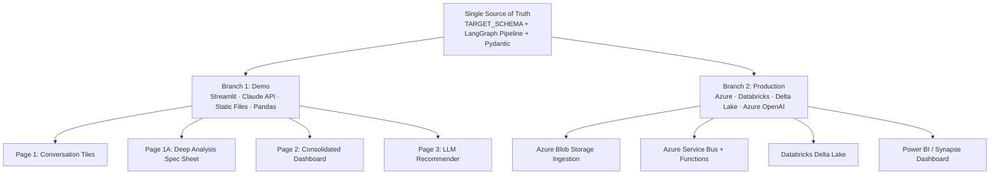
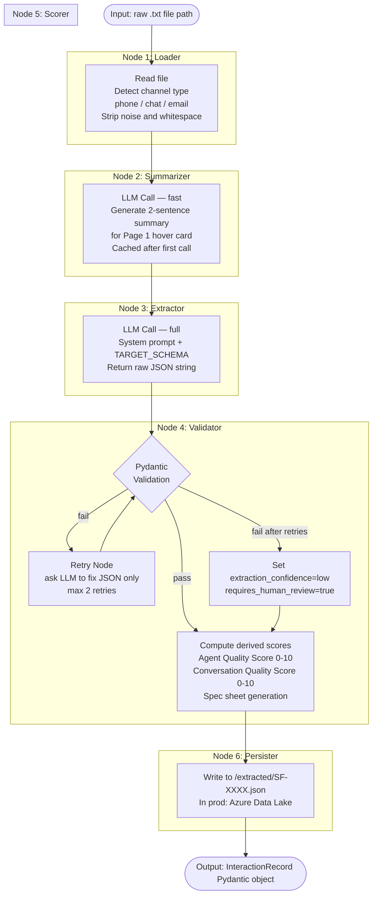
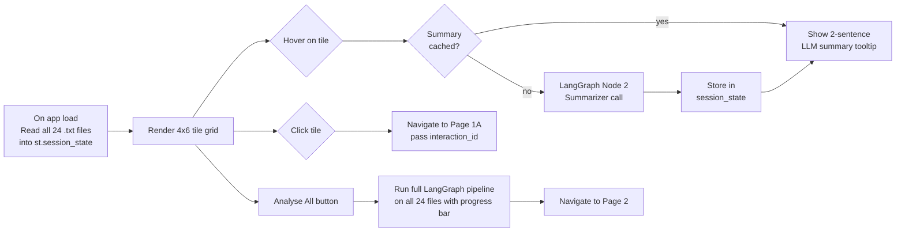
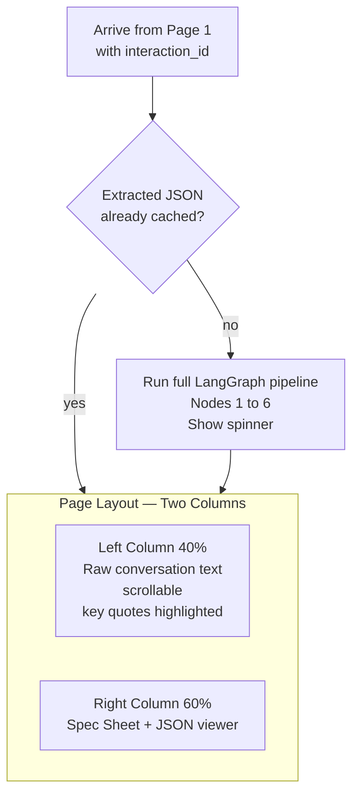
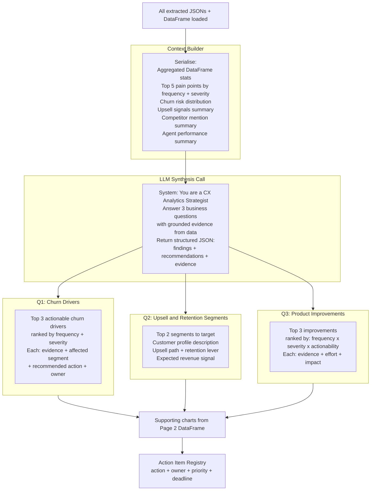
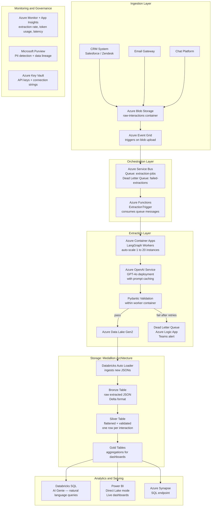
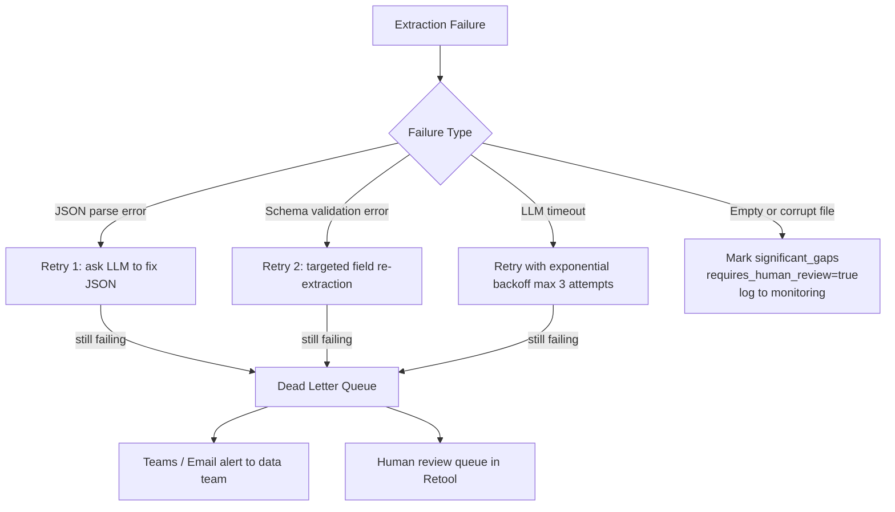
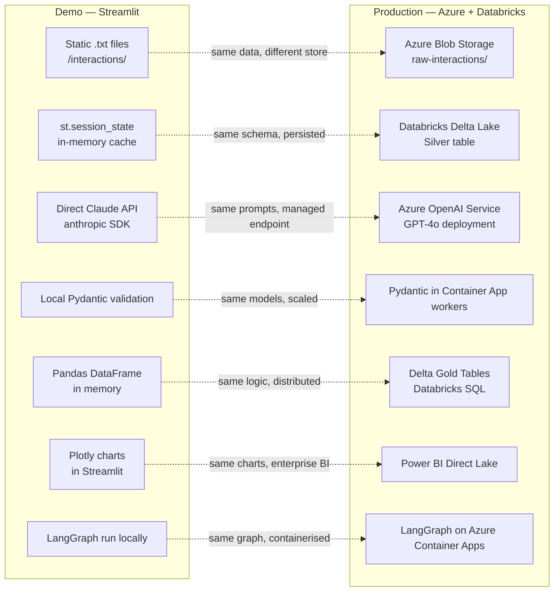

# StreamFit: Full System Plan — Demo + Production Architecture

---

## Two Branches, One Truth



---

## 1. Project File Structure

```
neilson/
├── interactions/               ← 24 raw .txt files (static, mimics Azure Blob)
├── extracted/                  ← populated JSON files (output cache)
├── TARGET_SCHEMA.json
├── ASSESSMENT_BRIEF.html
│
├── pipeline/
│   ├── __init__.py
│   ├── models.py               ← Pydantic models mirroring TARGET_SCHEMA
│   ├── graph.py                ← LangGraph extraction graph
│   ├── prompts.py              ← all LLM prompts (system + extraction + summary)
│   └── loader.py               ← file reader + channel detector
│
├── analysis/
│   ├── __init__.py
│   ├── dataframe.py            ← JSON → flat Pandas DataFrame builder
│   └── charts.py               ← all Plotly chart functions
│
├── app/
│   ├── main.py                 ← Streamlit entry point + router
│   ├── page1_tiles.py          ← Page 1
│   ├── page1a_detail.py        ← Page 1A
│   ├── page2_dashboard.py      ← Page 2
│   └── page3_recommender.py    ← Page 3
│
├── ai_workflow/                ← Screenshots + logs (mandatory deliverable)
├── requirements.txt
└── SOLUTION_ARCHITECTURE.md
```

---

## 2. Core Pipeline: LangGraph Extraction Graph

The engine powering the demo — and the same logic that runs in Azure Container Apps in production.



### LangGraph State Object

```python
class PipelineState(TypedDict):
    file_path: str
    raw_text: str
    channel: str           # phone | live_chat | email
    summary: str           # 2-sentence hover card summary
    raw_llm_output: str    # raw string from LLM before Pydantic parsing
    extracted: dict        # parsed JSON dict
    validated: InteractionRecord  # Pydantic model
    scores: dict           # agent_quality_score, conversation_quality_score
    retry_count: int
    errors: list[str]
```

---

## 3. Pydantic Models (pipeline/models.py)

Mirrors TARGET_SCHEMA exactly — but adds computed fields for the spec sheet.

```python
class InteractionRecord(BaseModel):
    interaction_id: str
    interaction: InteractionMeta
    customer: Customer
    sentiment: Sentiment
    insights: Insights
    intent: Intent
    topics: list[Topic]
    action_items: list[ActionItem]
    quality_flags: QualityFlags

    # Derived fields — computed in Node 5, not in TARGET_SCHEMA
    agent_quality_score: float          # 0–10 weighted composite
    conversation_quality_score: float   # 0–10 weighted composite
    hover_summary: str                  # 2-sentence card text
```

### Scoring Logic (Node 5)

Both scores are computed deterministically from the extracted Pydantic model — **no LLM call**, pure arithmetic on structured fields. Max score is 10.0.

---

#### Agent Quality Score (0–10)

Measures how well the agent handled the interaction. Four additive sub-scores, weighted by business importance:

| Sub-score | Source Field | Logic | Max | Rationale |
|-----------|-------------|-------|-----|-----------|
| **Resolution** | `interaction.resolution.status` | `resolved`=3.5, `partially_resolved`=1.8, `escalated`=1.2, `cancelled`=0.5, `unresolved`=0.0 | **3.5** | Primary outcome — the single most important signal |
| **Interaction Quality** | `quality_flags.interaction_quality` | `clean`=2.5, `minor_issues`=1.5, `significant_gaps`=0.5 | **2.5** | Clean transcripts reflect agent professionalism and discipline |
| **Empathy** | `interaction.agent.handled_well` | `True` → 2.0, `False` → 0.8 | **2.0** | Important for CX but secondary to actual outcome |
| **Action Follow-through** | `action_items[].status` | `completed / total * 2.0` | **2.0** | Rewards closure, but outcome > process |

```
agent_quality_score = min(resolution + interaction_quality + empathy + action_follow_through, 10.0)
```

**Example:** Agent who resolved the issue, handled it with empathy, 1/2 actions completed, clean transcript → 3.5 + 2.5 + 2.0 + 1.0 = **9.0**

**Key constraint:** `partially_resolved` caps resolution at 1.8, so a partially-resolved interaction scores max ~8.3 — never reaches 9.0. This is intentional.

---

#### Conversation Quality Score (0–10)

Measures data richness and signal quality of the interaction itself — independent of the agent. Three additive sub-scores:

| Sub-score | Source Field | Logic | Max |
|-----------|-------------|-------|-----|
| **Extraction Confidence** | `quality_flags.extraction_confidence` | `high`=4.0, `medium`=2.5, `low`=1.0 — reflects how reliably the LLM could parse the transcript | 4.0 |
| **Schema Completeness** | 4 key sections present: `customer`, `sentiment`, `insights`, `intent` | `(filled_sections / 4) * 3.0` — penalises sparse or redacted transcripts | 3.0 |
| **Sentiment Trajectory** | `sentiment.trajectory` | `improving`=3.0, `stable`=2.0, `declining`=1.0 — conversations that end better are more valuable | 3.0 |

```
conversation_quality_score = min(extraction_confidence + completeness + sentiment_trajectory, 10.0)
```

**Example:** High-confidence extraction, all 4 sections filled, sentiment declining → 4.0 + 3.0 + 1.0 = **8.0**

---

#### Key Design Decisions

- **Agent score ≠ Conversation score**: A great agent can have a low conversation score (sparse transcript, low confidence). A terrible agent can have a high conversation score (full data extracted, detailed complaint = rich signal).
- **No magic constants**: all thresholds map to explicit business semantics (e.g. `resolved` is simply better than `partially_resolved`).
- **Deterministic**: same input always produces same score. No LLM variance in scoring — only in extraction.
- **Bounded at 10.0**: `min(sum, 10.0)` prevents impossible scores when multiple high-value fields are present.

---

## 4. Page 1 — Conversation Tiles

**Purpose:** Entry point. Visual index of all 24 interactions. Hover = quick insight. Click = deep dive. "Analyse All" = batch pipeline run.



### Tile Card Design

```
┌─────────────────────────┐
│  📞  SF-2026-0001       │
│  Phone · Feb 10         │
│  Agent: Sarah Mitchell  │  ← color-coded border:
│  ─────────────────────  │    🔴 high churn risk
│  [hover: 2-line summary]│    🟡 medium
└─────────────────────────┘    🟢 low / none
```

Each tile shows:
- Channel icon (📞 phone / 💬 chat / 📧 email)
- Interaction ID
- Date from filename
- Agent name (extracted from text)
- Color-coded border by churn risk (if already extracted)

---

## 5. Page 1A — Deep Analysis Spec Sheet

**Purpose:** Full dissection of a single conversation. Shows the pipeline working — raw text in, populated schema out, derived insights rendered as a spec sheet.



### Right Column — The Full Spec Sheet

**Section A: Interaction Snapshot**
| Field | Value |
|-------|-------|
| Type | cancellation / support_request / etc. |
| Channel | phone / live_chat / email |
| Resolution | resolved / unresolved / escalated |
| Duration | X seconds |

**Section B: Core Problem Identification**
- **Primary Issue** — crux derived from `intent.primary` + top `pain_points`
- **Secondary Issues** — from `topics` + secondary pain points
- **Verbatim Quote** — best evidence quote from customer
- **Actionability** — can we fix this? Yes/No + reasoning

**Section C: Customer Profile**
| Field | Value |
|-------|-------|
| Name | extracted or null |
| Plan | free_trial / basic / premium / family |
| Tenure | X months |
| Lifecycle Stage | at_risk / active / churning / etc. |
| Fitness Level | beginner / intermediate / advanced |
| Household | couple / family / etc. |

**Section D: Sentiment Analysis**
- Overall sentiment pill (color-coded)
- Trajectory arrow (improving ↑ / declining ↓ / stable →)
- Emotional intensity badge
- Key Moments timeline — chronological with trigger + shift type

**Section E: Churn & Upsell Signals**
```
Churn Risk: 🔴 HIGH
Factors:
  • Content staleness (mentioned 3x)
  • Competitor FitFlow — considering switching
  • Save attempted: Yes → Successful: Yes

Upsell Opportunity: 🟡 MEDIUM
Target: Premium Annual Plan
Signals:
  • Expressed willingness to pay more for yoga content
  • Household has 2 users
```

**Section F: Agent Evaluation Scorecard**
| Dimension | Score | Evidence |
|-----------|-------|----------|
| Empathy & tone | 8/10 | Acknowledged frustration immediately |
| Resolution effectiveness | 7/10 | Partial resolution, follow-up pending |
| Policy adherence | 9/10 | Followed discount approval protocol |
| Communication clarity | 8/10 | Clear next steps given to customer |
| **Overall Agent Score** | **8.0/10** | |

**Section G: Action Items**
Table of `action_items` with owner, priority, and status badges.

**Section H: Quality Flags**
- Extraction confidence pill (high / medium / low)
- Human review required? Yes / No
- Review reasons listed if applicable

**Section I: Raw JSON Panel (collapsible)**
Inside `st.expander("View Populated TARGET_SCHEMA →")` — syntax-highlighted full JSON output. Also a tab: **"Raw LLM Output"** showing the pre-Pydantic string (satisfies assessment brief requirement directly).

**Footer:** `→ Go to Page 2: Consolidated Dashboard` button

---

## 6. Page 2 — Consolidated Analytics Dashboard

**Purpose:** Aggregate view across all processed interactions. Full analyst-grade dashboard answering strategic questions with data.

### DataFrame Schema (one row per interaction)

```
interaction_id | channel | type | resolution_status | agent_name |
agent_handled_well | agent_quality_score | conv_quality_score |
customer_name | customer_plan | lifecycle_stage | tenure_months |
age_range | fitness_level | churn_risk_level | churn_risk_score |
save_attempted | save_successful | upsell_level | upsell_score |
upsell_target_plan | sentiment_overall | sentiment_score |
sentiment_trajectory | emotional_intensity | top_pain_category |
top_pain_severity | pain_count | pain_severity_score |
has_competitor_mention | competitor_name | feature_request_count |
extraction_confidence | requires_human_review |
is_high_value | is_save_win
```

**Derived / Enriched Columns (computed, not in TARGET_SCHEMA):**
- `churn_risk_score` — numeric: none=0, low=1, medium=2, high=3, immediate=4
- `upsell_score` — numeric: none=0, low=1, medium=2, high=3
- `sentiment_score` — numeric: very_negative=-2, negative=-1, mixed/neutral=0, positive=1, very_positive=2
- `pain_severity_score` — numeric: low=1, medium=2, high=3, critical=4
- `is_high_value` — boolean: premium/family plan AND tenure > 12 months
- `is_save_win` — boolean: save_attempted AND save_successful

### 12 Visualizations Across 4 Sections

**Section 1: Customer Health Overview**
1. **Churn Risk Funnel** — Horizontal funnel: none → low → medium → high → immediate (count + %)
2. **Lifecycle Stage Donut** — new / onboarding / active / at_risk / churning / churned
3. **Sentiment by Channel** — Stacked bar: sentiment_score grouped by phone / chat / email

**Section 2: Pain Points & Issues**
4. **Top Pain Categories** — Ranked horizontal bar: billing / content / app_performance / pricing / customer_service
5. **Pain Severity Heatmap** — Category × severity matrix, count as cell value
6. **Feature Request Frequency** — Ranked table: feature name → count → avg urgency score

**Section 3: Agent & Resolution Performance**
7. **Agent Scorecard Table** — agent_name | avg_quality_score | interactions | resolution_rate | save_rate
8. **Resolution Status Donut** — resolved / partially_resolved / unresolved / escalated / cancelled
9. **Save Attempts Funnel** — At-risk → save attempted → save successful

**Section 4: Opportunity Signals**
10. **Upsell Opportunity Matrix** — Scatter: lifecycle_stage (x) vs upsell_score (y), colored by plan, sized by tenure
11. **Competitor Mention Tracker** — Bar: competitor name → count, colored by sentiment_vs_us
12. **High-Value at Risk Table** — Customers flagged `is_high_value` AND `churn_risk_level >= medium`

**Footer:** `→ Get Recommendations: Open Page 3` button

---

## 7. Page 3 — LLM Recommender & Action Engine

**Purpose:** Synthesise everything into boardroom-ready strategic recommendations answering the 3 business questions with data evidence.



### Page 3 Layout

**3.1 Executive Summary** — LLM-generated, 3 sharp bullets. "Tell leadership in 30 seconds."

**3.2 Q1 — Top Churn Drivers**
- Bar chart: pain category × count, filtered to churn_risk >= medium
- For each driver: what it is → who it affects → what to do → who owns it
- Verbatim customer quotes as evidence

**3.3 Q2 — Upsell & Retention Segments**
- Segment table: lifecycle stage → count → avg upsell score → recommended action
- Best-opportunity profile: "Premium plan, 10–18 months tenure, fitness-active, family household"
- Save success rate: when it works, what was the offer?

**3.4 Q3 — Product & Service Improvements**
- Impact-effort 2×2 matrix: Quick wins / Big bets / Fill-ins / Avoid
- Feature requests ranked by: frequency × urgency × sentiment
- Agent improvement recommendations from scorecard data

**3.5 Action Item Registry**
| # | Action | Owner | Priority | Deadline | Evidence |
|---|--------|-------|----------|----------|----------|
| 1 | Add advanced yoga/HIIT content | Product | Urgent | 30d | 5 mentions, 2 churn risks |
| 2 | Fix Samsung TV app crashes | Engineering | High | 14d | App performance pain, 3 users |
| 3 | Improve agent empathy training | CX | Medium | 45d | Avg agent score 6.8/10 |

---

## 8. Production Architecture — Azure + Databricks



### Medallion Architecture (Databricks Delta Lake)

```mermaid
flowchart LR
    RAW[Raw .txt\nAzure Blob] --> BRONZE

    subgraph BRONZE["Bronze — raw_interactions"]
        B1[interaction_id]
        B2[raw_text]
        B3[extracted_json raw string]
        B4[ingestion_timestamp]
        B5[source_file_path]
    end

    BRONZE --> SILVER

    subgraph SILVER["Silver — interactions_validated"]
        S1[All TARGET_SCHEMA fields flattened]
        S2[agent_quality_score]
        S3[conv_quality_score]
        S4[derived columns]
        S5[processing_timestamp]
    end

    SILVER --> GOLD

    subgraph GOLD["Gold — Business-ready Aggregates"]
        G1[churn_risk_summary]
        G2[upsell_opportunities]
        G3[pain_point_analysis]
        G4[agent_performance]
        G5[feature_request_tracker]
    end
```



### Cost Model at Scale (10,000 interactions/month)

| Component | Unit Cost | Monthly Volume | Monthly Cost |
|-----------|-----------|----------------|--------------|
| Azure OpenAI GPT-4o (input) | $2.50/1M tokens | ~50M tokens | ~$125 |
| Azure OpenAI GPT-4o (output) | $10/1M tokens | ~10M tokens | ~$100 |
| Azure Blob Storage | $0.018/GB | ~2GB raw text | ~$0.04 |
| Azure Container Apps | ~$0.000024/vCPU-s | 10K jobs × 30s | ~$7 |
| Azure Data Lake Gen2 | $0.023/GB | ~5GB JSON | ~$0.12 |
| Databricks (Standard DBU) | $0.22/DBU | ~200 DBU/month | ~$44 |
| **Total** | | | **~$280/month** |

Demo cost for 24 interactions (direct Claude API): **~$0.12 total**

### Error Handling Strategy



### Data Quality Edge Cases

| Edge Case | Detection | Handling |
|-----------|-----------|---------|
| Empty transcript | file size < 100 bytes | Skip, flag `significant_gaps` |
| Non-English content | langdetect pre-LLM | Route to multilingual model variant |
| PII in output | Azure Purview scan | Redact before writing to Gold |
| Duplicate interaction | Hash of raw_text | Deduplicate in Silver layer |
| Partial transcript | Low field completion % | Set `extraction_confidence=low` |
| Redacted sections | `[REDACTED]` pattern in text | Note in `review_reasons` |

---

## 9. Demo → Production Component Mapping



---

## 10. LLM Prompts Design (pipeline/prompts.py)

### Prompt 1 — Hover Summary (Node 2, fast + cheap)
```
System: You are a concise customer service analyst.
User:   Summarize this customer interaction in exactly 2 sentences.
        First sentence: what the customer needed.
        Second sentence: how it was resolved.
        [INTERACTION TEXT]
```

### Prompt 2 — Full Extraction (Node 3, thorough)
```
System: You are a structured data extraction engine.
        Extract information from the customer interaction below and
        return ONLY a valid JSON object matching this exact schema.
        Use null for fields you cannot determine. Do not invent information.
        [TARGET_SCHEMA]

User:   Channel type: {channel}
        Interaction ID: {interaction_id}
        [INTERACTION TEXT]
```

### Prompt 3 — Page 3 Synthesis (strategic intelligence)
```
System: You are a Chief Customer Officer advising a fitness streaming company.
        Answer 3 strategic questions with specific evidence from the interaction data.

User:   Aggregated data summary: [serialized DataFrame stats]
        Top pain points: [list]
        Churn risk distribution: [dict]
        Upsell signals: [list]
        Competitor mentions: [dict]
        Agent performance: [dict]

        Questions:
        1. What are the top drivers of customer churn, and which are most actionable?
        2. Which customer segments show the highest upsell or retention opportunity?
        3. What product/service improvements would have highest impact on satisfaction?

        For each finding provide: finding, evidence (with numbers), recommended action,
        owner (product/engineering/cx/management), priority (urgent/high/medium/low).
```

---

## 11. Tech Stack Summary

| Layer | Demo | Production |
|-------|------|------------|
| UI | Streamlit | Power BI / Azure App Service |
| Pipeline Orchestration | LangGraph (local) | LangGraph on Azure Container Apps |
| LLM | Claude API (direct) | Azure OpenAI (GPT-4o) |
| Validation | Pydantic v2 | Pydantic v2 (in workers) |
| Storage — Raw | Static .txt files | Azure Blob Storage |
| Storage — Structured | JSON files + session_state | Databricks Delta Lake |
| Analytics | Pandas + Plotly | Databricks SQL + Power BI |
| Queue | None (synchronous) | Azure Service Bus |
| Monitoring | None | Azure Monitor + App Insights |
| Security | .env API key | Azure Key Vault + AAD |
| Governance | None | Microsoft Purview |

---

## 12. Build Order

```mermaid
gantt
    title Build Sequence
    dateFormat HH:mm
    axisFormat %H:%M

    section Foundation
    pipeline/models.py Pydantic models     :f1, 00:00, 30m
    pipeline/prompts.py all prompts        :f2, after f1, 20m
    pipeline/loader.py file reader         :f3, after f2, 15m
    pipeline/graph.py LangGraph graph      :f4, after f3, 45m

    section Extraction
    Test pipeline on 5 diverse interactions :e1, after f4, 30m
    Batch run all 24 to /extracted/         :e2, after e1, 20m

    section Analysis
    analysis/dataframe.py flat builder     :a1, after e2, 30m
    analysis/charts.py all 12 charts       :a2, after a1, 45m

    section Streamlit App
    app/main.py router and navigation      :s1, after a2, 15m
    app/page1_tiles.py                     :s2, after s1, 30m
    app/page1a_detail.py spec sheet        :s3, after s2, 45m
    app/page2_dashboard.py                 :s4, after s3, 45m
    app/page3_recommender.py               :s5, after s4, 45m

    section Architecture
    Production diagram and cost model      :d1, after s5, 30m
```



---

## 13. Key Suggestions

1. **Cache extractions to disk** — once `/extracted/SF-XXXX.json` exists, skip re-running the pipeline. Show cache-hit vs fresh extraction in the UI — this visually demonstrates the production batch concept.

2. **Show raw LLM output** — in Page 1A, add a tab: "Raw LLM Output" showing the pre-Pydantic JSON string. This directly satisfies the brief's explicit requirement and is impressive to interviewers.

3. **Model benchmarking as a hidden gem** — run 3 interactions through both Claude Sonnet and Claude Haiku. Compare field completeness, latency, token count. Show as a table. This demonstrates cost/quality trade-off thinking — exactly what architecture scoring rewards.

4. **Confidence-coloured tile borders** — on Page 1, colour each tile border green / yellow / red based on `extraction_confidence`. Immediately shows the human review routing concept visually, without saying a word.

5. **Ground Page 3 in real numbers** — pass actual aggregated stats into the synthesis prompt. "3 of 7 processed interactions cite content staleness as a churn factor" beats any hallucinated claim and shows data-grounded AI.

6. **Cost comparison in the architecture slide** — "24 interactions (demo) = $0.12 in API costs. 10,000 interactions/month = ~$280/month total system cost." Concrete, impressive, directly answers the cost management requirement.

7. **Start the ai_workflow/ folder now** — screenshot this planning conversation, the Claude Code terminal, the app running. This deliverable is mandatory and easiest to forget.
